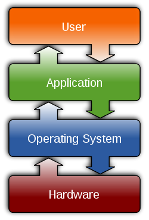

% Wprowadzenie do systemu GNU/Linux
% Marcin Fabrykowski
% {heigth=50px}

## Czym jest system operacyjny???

- To program, który zarządza zasobami komputera.

- Zapewnia warstwę abstrakcji pomiędzy sprzętem a programami użytkownika.

- Pozwala na uruchamianie innych programów.

## Architektura



## Jak wygląda OS?

Windows

{width=85%}

## Jak wygląda OS?

Linux

::: {.r-stack}
{width=80% .fragment }
{width=80% .fragment }
{width=80% .fragment }
:::

## Po co mi Linux?

- Po prostu desktop
- Administracja serwerami
- Programowanie (kontenery)
- Raspberry Pi

## Dlaczego Linux? {data-transition="none-out"}

- Otwartość kodu źródłowego

- Darmowość

- Bezpieczeństwo

- Stabilność

- Konfigurowalność

- Zasobożerność (a raczej jej brak)

::: notes

goły system ok 70 MB RAM.
z httpd i mysql ok 150 MB RAM

:::


## Plan warsztatów

::: nonincremental

- łączenie się z serwerem
- poruszanie się po systemie
- uruchomienie prostej aplikacji
- operacje na plikach i katalogach
- instalacja oprogramowania
- obsługa edytora vim
- konfiguracja strony WWW
- podstawy wyrażeń regularnych
- konfiguracja bloga opartego o Wordpress

:::

## Konwencje w prezentacji

- `polecenie` - polecenie, które należy wpisać w terminalu
- `<nazwa>` - zmienna, którą należy zastąpić odpowiednią wartością (bez znaków `<` i `>`)
- `cd <userX>` oznacza `cd user40` (dla `user40`)

## łączenie się z serwerem

- Ściągnij program PuTTY (https://putty.org/)
- Wpisz adres: `ssh.warsztaty.linux.org.pl`
- Wpisz login: `<userX>` (np. `user40`)
- Wpisz hasło: `<userX>_pass` (np: `user40_pass`; hasło nie będzie wyświetlane)
- Już :)

## Prompt

```
user3@warsztaty:~$
```

- `user3` - nazwa użytkownika
- `@` - at
- `warsztaty` - nazwa hosta
- `~` - bieżący katalog
- `$` - zwykły użytkownik
- `#` - administrator

## Składnia poleceń

- `polecenie`&blank;`[opcje]`&blank;`[argumenty]`
- `ls -l /etc`

## Struktura systemu plików

```{.bash .number-lines}
/
├── run
│   ├── agetty.reload
│   ├── apache2
│   │   └── apache2.pid
│   ├── console-setup
│   │   └── boot_completed
├── etc
│   ├── aliases
│   ├── alternatives
│   │   └── aclocal -> /usr/bin/aclocal-1.16
```
- system plików jest drzewem
- `/` - katalog główny
- wszystkie katalogi są podkatalogami katalogu `/`

## Struktura systemu plików

Przykładowe ścieżki do plików i katalogów
```{.bash .number-lines}
# katalogi
/etc/
/home/
/home/user1/

# pliki
/etc/passwd
/var/www/html/user1/strona/index.html
/home/user1/strona/index.html
/home/user1/strona/assets/images/show-event-02.jpg
```

## Ścieżki do plików i katalogów

- ścieżki mogą być względne i bezwzględne
- ścieżka względna wskazuje na plik lub katalog względem bieżącego katalogu
- ścieżka bezwzględna wskazuje na plik lub katalog względem katalogu głównego

## Ścieżki do plików i katalogów

Będąc w katalogu  
  `/home/user1/`  
  ścieżka do pliku `index.html` to:

:::::::::::::: {.columns}
::: {.column width="50%"}
- ścieżka względna:  
  ```{.bash}
  index.html
  ```
- ścieżka bezwzględna:  
  ```{.bash}
  /home/user1/index.html
  ```
:::
::: {.column width="50%"}
```{.bash}
home/
├── user1 <==
│   └── index.html
└── user2
    └── notatki.txt
```
:::
::::::::::::::

## Ścieżki do plików i katalogów

Natomiast będąc w katalogu  
  `/home/user2/`  
  ścieżka do tego samego pliku `index.html` to:

:::::::::::::: {.columns}
::: {.column width="50%"}
- ścieżka względna:  
  ```{.bash}
  ../user1/index.html
  ```
- ścieżka bezwzględna:  
  ```{.bash}
  /home/user1/index.html
  ```
:::
::: {.column width="50%"}
```{.bash}
home/
├── user1{.bash}
│   └── index.html
└── user2 <==
    └── notatki.txt
```
:::
::::::::::::::

## Poruszanie się po systemie

- `pwd` - wyświetla ścieżkę do bieżącego katalogu
- `ls` - wyświetla zawartość katalogu
- `cd <katalog>` - zmienia bieżący katalog
- `mkdir` - tworzy katalog
- `rmdir` - usuwa katalog
- `tree` - wyświetla strukturę katalogów


## najważniejsze katalogi

::: nonincremental

- `/` - katalog główny
- `/etc` - konfiguracja systemu
- `/bin`, `/sbin` - programy systemowe
- `/usr` - programy użytkowe
- `/home` - katalogi użytkowników
- `/tmp` - dane tymczasowe
- `.` - bieżący katalog
- `..` - katalog nadrzędny

:::

## Zadanie 0 - pierwsze uruchomienie programu

Pierwszym zadaniem będzie uruchomienie programu `cmatrix`.

::: nonincremental

- aby uruchomić program, wpisz jego nazwę i naciśnij `Enter` 
  ```{.bash}
  cmatrix
  ```
- aby zakończyć program, naciśnij `CTRL+c`

:::

## Zadanie 0 - przekazywanie parametrów

::: nonincremental

- parametry mogą być bez wartości, np. `-r`
  ```{.shell}
  cmatrix -r
  ```
- parametry mogą mieć wartość, np. `-C red`
  ```{.shell}
  cmatrix -C red
  ```
- parametry można łączyć
  ```{.shell}
  cmatrix -C blue -u 4 -s
  ```
:::

## Zadanie 1 - uruchomienie aplikacji

Drugą aplikacją, którą uruchomimy, będzie aplikacja webowa.
Aplikacja znajduje się w katalogu `/opt/flask-app`.

## Zadanie 1 - uruchomienie aplikacji

::: nonincremental

- przejdź do katalogu z aplikacją 
  ```{.bash}
  cd /opt/flask-app
  ```
- wyświetl zawartość katalogu
  ```{.bash}
  ls
  ```

- uruchom aplikację 
  ```{.bash}
  ./app.py
  ```
- przejdź do przeglądarki i otwórz stronę:  
  ```{.shell}
  https://user<X>.warsztaty.linux.org.pl
  ```

:::

## Operacje na plikach i katalogach

- `cat` - wyświetla zawartość pliku
- `less` - wyświetla zawartość pliku (po stronach)
- `head` - wyświetla początkowe linie pliku
- `tail` - wyświetla końcowe linie pliku
- `cp` - kopiowanie plików
- `mv` - przenoszenie i zmiana nazwy plików
- `rm` - usuwanie plików
 
## Operacje na plikach i katalogach

- `cat <plik>` - wyświetla zawartość pliku
- `tail <plik>` - wyświetla końcowe linie pliku
- `tail -n <liczba> <plik>` - wyświetla ostatnie `<liczba>` linii pliku
- `tail -F <plik>` - wyświetla końcowe linie pliku i śledzi zmiany (ctrl+c aby zakończyć)

## Operacje na plikach i katalogach

- `cp <plik1> <plik2>` - kopiuje plik1 do pliku2
- `cp <plik1> <katalog>` - kopiuje plik1 do katalogu
- `mv <plik1> <plik2>` - zmienia nazwę pliku1 na plik2
- `mv <plik1> <katalog>` - przenosi plik1 do katalogu

## Zadanie 2a - wyświetlenie zawartości pliku

Nasza aplikacja stworzyła plik z bazą danych.
Aby go wyświetlić, użyjemy polecenia `cat`.

::: nonincremental

- przejdź do katalogu z aplikacją 
  ```{.bash}
  cd /opt/flask-app
  ```
- wyświetl zawartość pliku `baza.db`
  ```{.bash}
  cat baza.db
  ```

:::

## Zadanie 2b - kopiowanie pliku

Możemy zrobić kopię pliku `baza.db` i nazwać ją `baza.db.bak`.

::: nonincremental

- skopiuj plik `baza.db` do pliku `baza.db.bak`
  ```{.bash}
  cp baza.db baza.db.bak
  ```
- wyświetl zawartość katalogu, aby sprawdzić, czy plik został skopiowany
  ```{.bash}
  ls
  ```
- wyświetl zawartość pliku `baza.db.bak`
  ```{.bash}
  cat baza.db.bak
  ```

:::

## Zadanie 2b - kopiowanie pliku

Możemy również przywrócić bazę danych z kopii.

::: nonincremental

- dodaj nowe dane do aplikacji
- wyświetl zawartość pliku `baza.db`
  ```{.bash}
  cat baza.db
  ```
- przywróć bazę danych z kopii
  ```{.bash}
  cp baza.db.bak baza.db
  ```
- wyświetl zawartość pliku `baza.db`
  ```{.bash}
  cat baza.db
  ```
- odśwież stronę aplikacji

:::

## Zadanie 2c - zmiana nazwy pliku

Możemy zmienić nazwę pliku `baza.db.bak` na `baza.db.<data>`.

::: nonincremental

- wyświetl zawartość katalogu, aby sprawdzić, czy plik istnieje
  ```{.bash}
  ls
  ```
- zmień nazwę pliku `baza.db.bak` na `baza.db.<data>`
  ```{.bash}
  mv baza.db.bak baza.db.20241010`
  ```
- wyświetl zawartość katalogu, aby sprawdzić, czy plik został zmieniony
  ```{.bash}
  ls
  ```

:::

## Zadanie 2d - usuwanie pliku

Możemy usunąć plik `baza.db.20241010`.

::: nonincremental

- wyświetl zawartość katalogu, aby sprawdzić, czy plik istnieje
  ```{.bash}
  ls
  ```
- usuń plik `baza.db.20241010`
  ```{.bash}
  rm baza.db.20241010
  ```
- wyświetl zawartość katalogu, aby sprawdzić, czy plik został usunięty
  ```{.bash}
  ls
  ```

:::

## Instalacja oprogramowania

- Do instalacji oprogramowania w systemie Linux służy (przeważnie) menadżer pakietów.

- W zależności od dystrybucji, mogą to być np.:

  ::: {.nonincremental}
  
  - `apt` - Debian, Ubuntu
  - `dnf` - Fedora
  
  :::

- Tylko administrator systemu może instalować oprogramowanie.

## Wykonywanie poleceń jako administrator

- Aby wykonać polecenie jako administrator, należy dodać przed nim `sudo`.
- składnia:  
  `sudo <polecenie>`

## Zadanie 3a - wykonywanie poleceń jako administrator

::: nonincremental

- sprawdzmy nazwę użytkownika
  ```{.bash}
  whoami
  ```
- wykonajmy polecenie `sudo whoami`
  ```{.bash}
  sudo whoami
  ```
- często spotykane jest przejście do trybu administratora
  ```{.bash}
  sudo su -
  ```
- wyjdźmy z trybu administratora
  ```{.bash}
  exit
  ```

:::

## Zadanie 3b - instalacja programu

Zainstalujemy edytor tekstu `vim`.

::: nonincremental

- sprawdź czy program `vim` jest zainstalowany
  ```{.bash}
  vim
  ```
- spróbuj zainstalować program `vim` jako użytkownik
  ```{.bash}
  dnf install vim
  ```
- zainstaluj program `vim` jako administrator
  ```{.bash}
  sudo dnf install vim
  ```
- sprawdź czy program `vim` jest zainstalowany
  ```{.bash}
  vim
  ```

:::

## Obsługa edytora vim

- vim jest edytorem modalnym, czyli ma kilka trybów pracy, m.in.:  
  - tryb normalny
  - tryb wstawiania
  - tryb wizualny

## Obsługa edytora vim

- tryb normalny - służy do nawigacji po pliku i wykonywania poleceń
- nawigować można za pomocą klawiszy `h`, `j`, `k`, `l` lub strzałek
- przejście do trybu wstawiania: `i`...
- ...jak również na kilkanaście innych sposobów
- wyjście z trybu wstawiania: `ESC`

## Obsługa edytora vim

- szukanie tekstu: `/tekst`
- zapisanie pliku: `:w`
- wyjście z vim-a: `:q`
- zapisanie i wyjście z vim-a: `:wq`

## Obsługa edytora vim {data-transition="none"}

- kopiowanie i wklejanie tekstu:
  - `yy` - kopiowanie linii
  - `p` - wklejanie
- usuwanie tekstu:
  - `dd` - usuwanie linii
  - `x` - usuwanie znaku
- cofanie i ponawianie zmian:
  - `u` - cofanie
  - `CTRL+r` - ponawianie

## Obsługa edytora vim (extra) {data-transition="none-in"}

- wejście do trybu wstawiania:
  - przed kursorem: `i`
  - za kursorem: `a`
  - na początku linii: `I`
  - na końcu linii: `A`
  - linijka poniżej: `o`
  - linijka powyżej: `O`

## Zadanie 4 - edycja pliku

Naszym zadaniem będzie zmiana nagłówka w naszej aplikacji

Kod html strony znajduje się w pliku `templates/index.html` względem katalogu aplikacji.

Należy zmienić nagłówek h1 z `Flask HTMX Demo` na dowlną inną wartość.

## Zadanie 4 - edycja pliku

::: nonincremental

- przejdź do katalogu z aplikacją 
  ```{.bash}
  cd /opt/flask-app
  ```
- uruchom edytor `vim` i otwórz plik `templates/index.html`
  ```{.bash}
  vim templates/index.html
  ```
- znajdź nagłówek h1 i zmień jego wartość
- zapisz plik i wyjdź z edytora

:::

## Zadanie 4 - edycja pliku

w edytorze `vim`:

::: nonincremental

- znajdź nagłówek h1
  ```{.bash}
  /<h1>
  ```
- użyj `i` aby przejść do trybu wstawiania
- zmień wartość nagłówka
- użyj `ESC` aby wyjść z trybu wstawiania
- zapisz plik
  ```{.bash}
  :wq
  ```

:::

## Zadanie 4 - edycja pliku

::: nonincremental

- uruchom aplikację
  ```{.bash}
  ./app.py
  ```
- odśwież stronę w przeglądarce
- zobacz zmiany w przeglądarce

:::

## System wieloużytkownikowy

- Linux jest systemem wieloużytkownikowym
- każdy użytkownik ma swoje katalogi domowe, uprawnienia i ustawienia
- każdy użytkownik może być zalogowany na kilku terminalach jednocześnie


## Zadanie 5 - praca na wielu terminalach

Naszym zadaniem będzie równoległe edytowanie pliku index.html or uruchomienie aplikacji

::: nonincremental

- otwórz drugi terminal
- zaloguj się jako ten sam użytkownik
- w pierwszym terminalu uruchom aplikację
- w drugim terminalu otwórz plik `index.html` i dokonuj zmian
- zapisz plik bez wychodzenia z edytora
- sprawdź zmiany w przeglądarce

:::


## Grep i wyrażenia regularne

- grep - pozwala wyszukiwać wzorce w tekście
- wykorzystywane jest to np:
  - do przeglądania logów
  - do przeszukiwania plików
  - do filtrowania wyników innych poleceń

## Grep i wyrażenia regularne

- `grep <wzorzec>` - wyszukuje wzorzec w wejściu standardowym
- `grep <wzorzec> <plik>` - wyszukuje wzorzec w pliku

## (bardzo) podstawowe wyrażenia regularne

- `.` - dowolny znak
- `*` - dowolna liczba poprzedzającego znaku
- `.*` - dowolna liczba dowolnych znaków
- `^` - początek linii
- `$` - koniec linii
- `[a-z],[abc],[0-9]` - dowolny znak z podanego zakresu

## Zadanie 5a - "grepowanie" plików

::: nonincremental

- wyświetl wszystkie linie z logu aplikacji
  ```{.bash}
  cat access.log
  ```
- wyświetl wszystkie linie z logu aplikacji zawierające słowo `POST`
  ```{.bash}
  grep POST access.log
  ```
- wyświetl wszystkie linie z logu z konkretego zakresu minut
  ```{.bash}
  grep '12:3[0-5]:' access.log
  ```
- wyświetl nagłówek h1 z pliku `index.html`
  ```{.bash}
  grep '<h1>' templates/index.html
  ```

:::

## Standardowe wejście i wyjście

- standardowe wejście - ujednolicone źródło danych dla programów
- standardowe wyjście - ujednolicone miejsce, gdzie programy wypisują dane
- domyślnie jest to klawiatura i ekran

## Standardowe wejście i wyjście - przekierowania

- można przekierować standardowe wyjście na plik
- można przekierować standardowe wyjście z jednego programu na standardowe wejście innego programu
- przekierowanie między programami nazywa się potokiem
- tworzy się go za pomocą znaku `|`

## Zadanie 5b - potoki

::: nonincremental

- śledź zmiany w logu aplikacji
  ```{.bash}
  tail -F access.log
  ```
- przekieruj wyjście z `tail` na `grep`
  ```{.bash}
  tail -F access.log | grep POST
  ```

:::

## Uprawnienia do plików i katalogów

- każdy plik i katalog ma właściciela i grupę
- każdy plik i katalog ma zestaw uprawnień, które dzieją się na 3 grupy
- uprawnienia można zmieniać za pomocą polecenia `chmod`
- uprawnienia można sprawdzać np za pomocą polecenia `ls -l`


## Uprawnienia do plików i katalogów

- uprawnienia dzielą się na:
  - uprawnienia właściciela (u)
  - uprawnienia grupy (g)
  - uprawnienia innych (o)
- typy uprawnień:
  - odczyt (read)
  - zapis (write)
  - wykonanie (execute)


## Uprawnienia do plików i katalogów
- przykład:  
`-rw-r--r-- index.html`
- zmiana uprawnień:  
`chmod u+x index.html`
- `-rwxr--r-- index.html`
- `chmod u+r <plik>`  
  `chmod g+r <plik>`  
  `chmod o+r <plik>`  
  `chmod +r <plik>`

## Uprawnienia do plików i katalogów

- przykład:  
`-rw-r--r-- index.html`
- zmiana uprawnień:  
`chmod 640 index.html`
- `-rw-r----- index.html`
- 640 jest w systemie ósemkowym
- 640 = 110 100 000 = `rw- r-- ---`

## Zadanie 6a - zmiana uprawnień do pliku

::: nonincremental

- sprawdź uprawnienia do pliku `data.db`
  ```{.bash}
  ls -l data.db
  ```
- usuń uprawnienie do zapisu dla pliku data.db
  ```{.bash}
  chmod -w data.db
  ```
- sprawdź uprawnienia do pliku `data.db`
  ```{.bash}
  ls -l data.db
  ```
- spróbuj dodać nowe dane do aplikacji

:::

## Zadanie 6b - zmiana uprawnień do pliku

::: nonincremental

- zabierz uprawnienia do odcztu dla pliku `data.db`
  ```{.bash}
  chmod -r data.db
  ```
- sprawdź uprawnienia do pliku `data.db`
  ```{.bash}
  ls -l data.db
  ```
- odśwież stronę aplikacji
- przywróć uprawnienia do pliku `data.db`
  ```{.bash}
  chmod 640 data.db
  ```

:::

## Przydatne polecenia przy instalacji aplikacji

- `wget <url>` - program do pobierania plików z internetu
- `tar` - program do archiwizacji plików
- `tar -xzf <archiwum>` - rozpakowuje archiwum tar.gz

## Zadanie 7 (finał) - instalacja bloga Wordpress

- ostatnim zadaniem będzie instalacja bloga Wordpress
- będzie to okazja do wykorzystania wszystkich poznanych wcześniej komend (i trochę więcej)
- to zadanie jest bardzo zbliżone do prawdziwych zadań, które wykonuje administrator systemu

## Zadanie 7 - instalacja Wordpress

Co należy zrobić:

- musimy zainstalować serwer WWW wraz z obsługą PHP i bazy danych
- musimy zainstalować i skonfigurować bazę danych
- musimy pobrać i rozpakować bloga Wordpress

## Zadanie 7 - instalacja Wordpress

Instalacja serwera WWW:

::: nonincremental

- zainstaluj serwer WWW Apache
  ```{.bash}
  sudo dnf install httpd
  ```
- zainstaluj PHP
  ```{.bash}
  sudo dnf install php
  ```
- uruchom serwer WWW
  ```{.bash}
  sudo systemctl start httpd
  ```

:::

## Zadanie 7 - instalacja Wordpress

Instalacja bazy danych:

::: nonincremental

- zainstaluj bazę danych MariaDB
  ```{.bash}
  sudo dnf install mariadb-server
  ```
- uruchom bazę danych
  ```{.bash}
  sudo systemctl start mariadb
  ```

:::

## Zadanie 7 - instalacja Wordpress

Konfiguracja bazy danych:

::: nonincremental

- utwórz bazę danych i użytkownika
  ```{.bash}
  sudo mysql -u root -p
  ```
- podajemy puste hasło
- stwórz bazę danych oraz użytkownika
  ```{.sql}
  CREATE DATABASE wordpress;
  CREATE USER 'wordpress'@'localhost' IDENTIFIED BY 'wordpress';
  GRANT ALL PRIVILEGES ON wordpress.* TO 'wordpress'@'localhost';
  FLUSH PRIVILEGES;
  quit
  ```
::: 

## Zadanie 7 - instalacja Wordpress

::: nonincremental

- przełącz się na konto administratora
  ```{.bash}
  sudo su -
  ```
- przejdź do katalogu ze stroną WWW:  
  ```
  cd /var/www/html/
  ```
- pobierz bloga Wordpress:
  ```
  wget https://wordpress.org/latest.tar.gz
  ```

- zainstaluj program wget
  ```{.bash}
  dnf install wget
  ```

:::


## Zadanie 7 - instalacja Wordpress

::: nonincremental

- rozpakuj archiwum:
  ```
  tar -xzf latest.tar.gz
  ```
- wyświetl zawartość katalogu
  ```{.bash}
  ls
  ```
- przejdź do strony z Wordpress
  ```{.bash}
  http://warsztaty.linux.org.pl:20080/worpress
  ```

:::

## Zadananie 7 - instalacja Wordpress

Napotykamy pierwszy problem - brak obsługi mysql w PHP.

::: nonincremental

- znajdź pakiet, który zawiera brakujące rozszerzenie
  ```{.bash}
  dnf search php-mysql
  # lub używając poleceń grep
  dnf search mysql | grep php
  ```
- zainstaluj brakujące rozszerzenie
  ```{.bash}
  dnf install php-mysqlnd
  ```
- zrestartuj serwer WWW or PHP
  ```{.bash}
  systemctl restart httpd
  systemctl restart php-fpm
  ```

:::

## Zadanie 7 - instalacja Wordpress

::: nonincremental

- odśwież stronę z Wordpress
- uzupełnij dane do bazy danych
  ```
  database: wordpress
  user: wordpress
  password: wordpress
  host: localhost
  ```  
- zatwierdź
- ups

:::

## Zadanie 7 - instalacja Wordpress

::: nonincremental

- Widzimy błąd, że plik `wp-config.php` nie mógł zostać utworzony.

- Wynika to z faktu, że serwer WWW nie ma uprawnień do zapisu w katalogu Wordpress.

- Musimy zmienić uprawnienia katalogu `/var/www/html/wordpress`.
  ```{.bash}
  chown -R apache:apache /var/www/html/wordpress
  ```
- cofnij się do strony z Wordpress i spróbuj ponownie

:::

## Co dalej?

- podręcznik manuala:
  ```
  man <polecenie>
  ```
  np:
  ```
  man ls
  ```
- społeczności:
  Polska Grupa Użytkowników Linuksa
  https://discord.linux.org.pl

- praktyka, praktyka, praktyka (maszyna wirtualna, vps, Raspberry Pi)

## Pytania?
